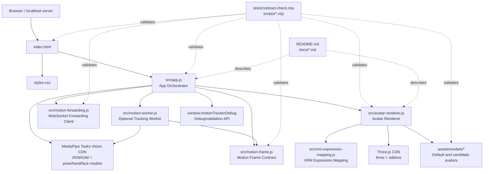

# Module Hierarchy

This document describes the current project hierarchy for `Browser Motion Tracker`.
It is a human-maintained architecture document for this static browser app.

## Overview

The project is a dependency-free static browser application. Runtime code is loaded
directly from `index.html` through ES modules and import maps. The central boundary is:

- `src/app.js` owns browser app orchestration, MediaPipe tracking, UI state, overlay drawing, and debug reports.
- `src/motion-worker.js` owns the optional module-worker MediaPipe detector used only when `?tracking-worker=on` is requested.
- `src/motion-frame.js` owns the normalized motion-frame and recording JSON contracts shared by live tracking, replay, and forwarding.
- `src/motion-forwarding.js` owns the optional browser WebSocket forwarding client.
- `src/vrm-expression-mapping.js` owns VRM0/VRM1 expression metadata parsing and MediaPipe blendshape-to-VRM preset mapping.
- `src/avatar-renderer.js` owns Three.js rendering, model loading, avatar retargeting, validation snapshots, view controls, and performance samples.
- `src/solver/` is the emerging pure solver boundary. It must stay DOM-free and renderer-free so synthetic GT and future joint-rotation checks can run in Node before the renderer applies poses.
- Everything under `scripts/` and `tests/` is validation/tooling, not runtime application code. `scripts/motion-recording-compare.mjs` compares live/browser recordings with offline/HMR recordings by solving both through the pure solver and reporting angle deltas.



## Runtime Module Tree

```text
Browser Motion Tracker
├─ Runtime shell
│  ├─ index.html
│  └─ styles.css
├─ App Orchestrator
│  └─ src/app.js
│     ├─ MediaPipe model lifecycle
│     ├─ optional module-worker detection lifecycle
│     ├─ optional FaceLandmarker lifecycle
│     ├─ camera/video input lifecycle
│     ├─ rVFC/rAF frame detection pump
│     ├─ motion-frame recording and replay lifecycle
│     ├─ optional motion forwarding lifecycle
│     ├─ 2D landmark overlay
│     ├─ app and avatar performance metrics
│     ├─ live motion status HUD
│     ├─ status/error state
│     ├─ strict/depth validation aggregation
│     └─ debug API exposure
├─ Motion Pipeline Contracts
│  ├─ src/motion-worker.js
│  │  ├─ opt-in worker model lifecycle
│  │  ├─ ImageBitmap frame detection
│  │  └─ serialized motionFrame result messages
│  ├─ src/motion-frame.js
│  │  ├─ normalized motionFrame schema
│  │  ├─ JSON recording schema
│  │  ├─ face payload normalization
│  │  └─ MediaPipe compatibility conversion helpers
│  └─ src/motion-forwarding.js
│     ├─ browser WebSocket client
│     ├─ stable forwarding payload shape
│     └─ connection status reporting
├─ Avatar Renderer
│  └─ src/avatar-renderer.js
│     ├─ Three.js scene lifecycle
│     ├─ GLB/VRM model loading
│     ├─ bone discovery and rest-pose cache
│     ├─ body/hand retargeting
│     ├─ VRM expression application
│     ├─ validation snapshots
│     ├─ orbit view controls
│     └─ performance sampling
├─ Static assets
│  └─ assets/models/**
├─ Validation tooling
│  ├─ tests/contract-check.mjs
│  ├─ tests/motion-recording-compare-check.mjs
│  ├─ scripts/validation-cli.mjs
│  ├─ scripts/hmr-jsonl-adapter.mjs
│  ├─ scripts/motion-recording-compare.mjs
│  ├─ scripts/motion-status-hud-smoke.mjs
│  └─ scripts/*.mjs
└─ Documentation
   ├─ README.md
   └─ docs/*.md
```

## Module Contracts

### Runtime Shell

Owned scope:

- `index.html`
- `styles.css`

Public surface:

- DOM element IDs consumed by `src/app.js`.
- Import map entries for `three` and `three/addons/`.
- Module entrypoint script: `./src/app.js`.

Consumes:

- `app.orchestrator` through the `type="module"` script tag.
- `ui.styles` through the stylesheet link.

Internal scope:

- Layout and visual styling decisions in `styles.css`.
- Static HTML structure outside the documented DOM IDs.

Rules:

- Do not rename DOM IDs without updating `src/app.js` and `tests/contract-check.mjs`.
- Do not load runtime scripts with `file://`; the app expects a localhost browser context.

### App Orchestrator

Owned scope:

- `src/app.js`

Public surface:

- Browser UI behavior wired from the DOM IDs in `index.html`.
- `window.motionTrackerDebug.getBodyValidationReport()`
- `window.motionTrackerDebug.getBodyValidationSamples()`
- `window.motionTrackerDebug.getLastBodyValidationSample()`
- `window.motionTrackerDebug.getAvatarDepthScale()`
- `window.motionTrackerDebug.setAvatarDepthScale(value)`
- `window.motionTrackerDebug.getAvatarPerformanceReport()`
- `window.motionTrackerDebug.clearAvatarPerformanceSamples()`
- `window.motionTrackerDebug.getAppPerformanceReport()`
- `window.motionTrackerDebug.getMotionStatusHudSnapshot()`
- `window.motionTrackerDebug.clearAppPerformanceSamples()`
- `window.motionTrackerDebug.getDetectionPumpStatus()`
- `window.motionTrackerDebug.getTrackingWorkerStatus()`
- `window.motionTrackerDebug.setDebugOverlayEnabled(value)`
- `window.motionTrackerDebug.getDebugOverlayEnabled()`
- `window.motionTrackerDebug.getAvatarViewState()`
- `window.motionTrackerDebug.resetAvatarView()`
- `window.motionTrackerDebug.clearBodyValidation()`
- `window.motionTrackerDebug.startMotionRecording()`
- `window.motionTrackerDebug.stopMotionRecording()`
- `window.motionTrackerDebug.getMotionRecording()`
- `window.motionTrackerDebug.getMotionRecordingJsonl()`
- `window.motionTrackerDebug.clearMotionRecording()`
- `window.motionTrackerDebug.loadMotionRecording(recording)`
- `window.motionTrackerDebug.loadMotionRecordingJsonl(jsonl)`
- `window.motionTrackerDebug.getMotionReplayStatus()`
- `window.motionTrackerDebug.stopMotionReplay()`
- `window.motionTrackerDebug.setFaceTrackingEnabled(enabled)`
- `window.motionTrackerDebug.getFaceTrackingStatus()`
- `window.motionTrackerDebug.getFaceTrackingEnabled()`
- `window.motionTrackerDebug.connectMotionForwarding(url)`
- `window.motionTrackerDebug.disconnectMotionForwarding()`
- `window.motionTrackerDebug.getMotionForwardingStatus()`

Consumes:

- MediaPipe Tasks Vision through the CDN import in `src/app.js`.
- Motion-frame helpers from `src/motion-frame.js`.
- Motion forwarding client from `src/motion-forwarding.js`.
- Public avatar renderer factory `createAvatarRenderer(options)`.
- Avatar renderer instance methods returned by `createAvatarRenderer`.
- Runtime shell DOM elements by documented ID.

Internal scope:

- Boot sequence and event binding.
- Camera and uploaded-video lifecycle.
- MediaPipe model selection and loading.
- Optional FaceLandmarker loading and inference.
- Optional module-worker detection initialization, request tracking, and fallback.
- Detection frame scheduling.
- `requestVideoFrameCallback` / `requestAnimationFrame` pump selection.
- Motion recording/replay state.
- Optional WebSocket forwarding state.
- Overlay drawing helpers.
- App-level performance sampling for callback, detection, optional face detection/process, process, draw, and frame-total timings.
- Strict/depth validation report builders.
- UI status and error text helpers.

Rules:

- `src/app.js` must not reach into `src/avatar-renderer.js` internals. It may only use the factory and returned API object.
- Debug API additions should be reflected in `README.md` and `tests/contract-check.mjs`.
- MediaPipe model URL/version changes must keep `tests/contract-check.mjs` aligned.
- Tracking worker mode must stay opt-in via `?tracking-worker=on`; failures must fall back to the main-thread detector and expose `fallbackReason`.
- Recording and forwarding must stay optional and must not start a local server.

### Motion Pipeline Contracts

Owned scope:

- `src/motion-worker.js`
- `src/motion-frame.js`
- `src/motion-forwarding.js`

Public surface:

- `createMotionFrame(options)`
- `serializeMotionFrame(frame)`
- `createMotionRecording(options)`
- `normalizeMotionRecording(recording)`
- `serializeMotionRecordingJsonl(recording)`
- `parseMotionRecordingJsonl(jsonl)`
- `normalizeExternalMotionRecording(recording)`
- `isExternalMotionRecording(recording)`
- `motionFrameToPoseResults(frame)`
- `motionFrameToHandResults(frame)`
- `normalizeFace(face)`
- Worker message types: `init`, `detect`, `close`
- `createMotionForwarder(options)`
- Forwarding payload type: `action-tracker-motion-frame`

Consumes:

- Browser `WebSocket` only when forwarding is explicitly connected.
- Plain MediaPipe result objects passed by `src/app.js`.
- `ImageBitmap` frames passed by `src/app.js` only when worker mode is requested.
- Worker-local `OffscreenCanvas` and `ImageData` conversion for MediaPipe detection.

Internal scope:

- Handedness normalization for motion-frame left/right fields.
- JSON-safe landmark cloning.
- Worker-local MediaPipe module-wasm landmarker lifecycle, ModuleFactory import bridge, and serialized result messages.
- Forwarding connection status and best-effort send failures.

Rules:

- Recording JSON must contain landmarks and metadata only; do not embed raw video or model binaries.
- External HMR import is a recording JSON contract only. WHAM, GVHMR, GEM-X, SAM 3D Body, and similar heavy extractors must run outside the browser and output normalized recording JSON with 33 `poseLandmarks`, 33 `poseWorldLandmarks`, optional 21-point hand landmarks, and scalar `source`/`sourceMeta` metadata.
- Live/offline comparison is a tooling concern. `scripts/motion-recording-compare.mjs` may load live and offline JSON/JSONL recordings, solve both with `src/solver/pose-solver.js`, and write target-angle/hinge-flexion deltas plus an optional static HTML graph report, but it must not add heavyweight HMR runtime dependencies to the browser app.
- External HMR adapter conversion belongs in `scripts/hmr-jsonl-adapter.mjs`. It may map simple external joint-array formats such as `mediapipe33` and `coco17` into the repo's MediaPipe-33 recording contract, but the browser runtime and `src/motion-frame.js` should continue to consume only normalized recording frames.
- Worker tracking is opt-in and must return the same serialized `motionFrame` shape as main-thread detection.
- Worker tracking must expose `requested`, `supported`, `active`, `frames`, `errors`, `fallbacks`, and `fallbackReason` through `getAppPerformanceReport().trackingWorker`.
- Forwarding must be client-only and explicit opt-in.
- The optional `face` field is serialized as blendshape scores plus transform matrix only; full face landmarks are not part of the default recording/forwarding contract. The transform matrix is part of the replayable head/neck pose signal.
- These modules must stay dependency-free.

### VRM Expression Mapping

Owned scope:

- `src/vrm-expression-mapping.js`

Public surface:

- `parseVrmExpressionMetadata(json)`
- `resolveVrmExpressionTargets(metadata, options)`
- `mapMediaPipeBlendShapesToVrmPresets(blendShapes)`
- `applyVrmExpressionScores(mapping, targetScores, previousScores, alpha)`
- `summarizeVrmExpressionMapping(mapping)`

Consumes:

- Plain GLTF JSON from `GLTFLoader`.
- Node lookup callback provided by `src/avatar-renderer.js`.
- Normalized `motionFrame.face.blendShapes`.

Internal scope:

- VRM0 preset alias normalization.
- VRM1 expression preset parsing.
- Morph target bind resolution.
- MediaPipe/ARKit blendshape scoring heuristics.

Rules:

- Do not import Three.js here. The renderer provides resolved node objects.
- Unknown blendshape names and missing morph targets must be ignored or reported diagnostically, not treated as runtime failures.
- Keep the mapping dependency-free and testable from Node.

### Avatar Renderer

Owned scope:

- `src/avatar-renderer.js`

Public surface:

- `createAvatarRenderer(options)`

Returned API:

- `init()`
- `update({ motionFrame, poseResults, handResults, mirrored, timestamp })`
- `getBodyValidationSnapshot(options)`
- `getProjectedBodyPoseSnapshot(options)`
- `getDepthValidationSnapshot(options)`
- `setSkeletonVisible(value)`
- `setDepthScale(value)`
- `getDepthScale()`
- `getPerformanceSnapshot()`
- `getModelDiagnostics()`
- `clearPerformanceSamples()`
- `resetView()`
- `getViewState()`
- `resetPose()`
- `resize()`
- `dispose()`

Consumes:

- `three`
- `three/addons/environments/RoomEnvironment.js`
- `three/addons/loaders/GLTFLoader.js`
- Default or uploaded avatar model URLs.

Internal scope:

- Bone name normalization and aliasing.
- Model-kind detection.
- Pose and hand landmark normalization.
- Normalized motion-frame consumption.
- Body, finger, head, neck, and limb retargeting.
- Face transform head/neck correction, face expression smoothing, and GLTF morph target influence application.
- Rest-pose, upper-body-aware depth, and proportion calibration.
- Landmark-visibility retarget gating and limb-plane secondary-axis stabilization.
- Retarget smoothing mode normalization and reporting.
- Rest-pose cache diagnostics and inferred bone orientation axis diagnostics.
- Swing/twist limiting.
- Validation row construction and summarization.
- Orbit camera pointer/wheel handling.
- Three.js resource disposal helpers.

Rules:

- Other runtime modules must not import helper functions from this file. The factory and returned API are the only public interface.
- New public methods must be added to the returned API object and documented here before `src/app.js` uses them.
- Avatar model loading failures must report failure state without breaking camera/video tracking.
- The renderer must continue to accept the legacy raw `poseResults`/`handResults` shape while `src/app.js` sends normalized `motionFrame`.

### Static Avatar Assets

Owned scope:

- `assets/models/Xbot.glb`
- `assets/models/ratio-candidates/soldier.glb`
- `assets/models/anime-candidates/*.vrm`
- `assets/models/**/*.json`
- `assets/models/**/*.md`
- `assets/models/threejs-LICENSE.txt`

Public surface:

- Default model URL: `./assets/models/Xbot.glb`
- User-loadable GLB/GLTF/VRM files through the browser file picker.
- Candidate model metadata used by validation and documentation.

Consumes:

- No runtime JavaScript modules.

Internal scope:

- Candidate metadata details that are not referenced by README/docs/tests.

Rules:

- `Xbot.glb` is the default runtime fallback and should not be modified casually.
- Model candidates must stay within the budget gates documented in `docs/avatar-model-validation.md`.
- License attribution for bundled third-party assets must stay with the asset.

### Validation Tooling

Owned scope:

- `tests/contract-check.mjs`
- `scripts/avatar-performance-check.mjs`
- `scripts/avatar-glb-performance-check.mjs`
- `scripts/avatar-vrm-performance-check.mjs`
- `scripts/frame-pump-performance-check.mjs`
- `tests/avatar-vrm-expression-check.mjs`
- `tests/motion-frame-check.mjs`
- `tests/motion-forwarding-check.mjs`

Public surface:

- `npm run check`
- `npm run perf:avatar`
- `npm run perf:avatar:soldier`
- `npm run perf:avatar:vrm`
- `npm run perf:pump`
- `node tests/motion-frame-check.mjs`
- `node tests/motion-forwarding-check.mjs`
- `node tests/avatar-vrm-expression-check.mjs`

Consumes:

- Runtime source files as static text.
- GLB/VRM model files as binary assets.
- `package.json` script declarations.

Internal scope:

- Parser/helper functions inside each validation script.

Rules:

- Validation scripts can inspect runtime internals as contract checks; runtime modules cannot depend on validation script internals.
- Keep validation scripts dependency-free unless the project intentionally adopts package dependencies.
- Add or update static checks whenever a public runtime contract changes.

### Documentation

Owned scope:

- `README.md`
- `docs/avatar-model-validation.md`
- `docs/MODULE_HIERARCHY.md`

Public surface:

- Local run instructions.
- Validation and performance gates.
- Runtime module boundaries and interface rules.

Consumes:

- Current source structure and validation scripts.

Internal scope:

- Historical notes that are not required to operate or maintain the app.

Rules:

- Documentation should describe verified behavior, not aspirational behavior.
- Any public debug API, model budget, or module boundary change should update the matching document in the same change set.

## Interface-Only Dependency Rules

Use these rules when implementing future module-scoped work:

1. Runtime modules may call another module only through the documented public surface.
2. A module's internal helpers are not a public interface, even if they are in the same file.
3. If a new feature needs another module's internal detail, first promote a minimal public method or return a change request for the owning module.
4. Validation tooling may inspect internals only to enforce contracts; it must not become a runtime dependency.
5. Public API changes must update this document, README/debug docs when relevant, and contract checks.

## Current Implementation-Orchestrator History

The repository contains historical local orchestration artifacts under
`.implementation-orchestrator-runs/`. They describe prior implementation work
such as strict validation, avatar tuning, and depth validation retargeting.
Those files are not runtime modules and are not the source of truth for the
current code hierarchy.

For new orchestrated work, create or update run state with the current
`implementation-orchestrator` skill and export a generated hierarchy document
from that state when the work units themselves need to be reviewed.
