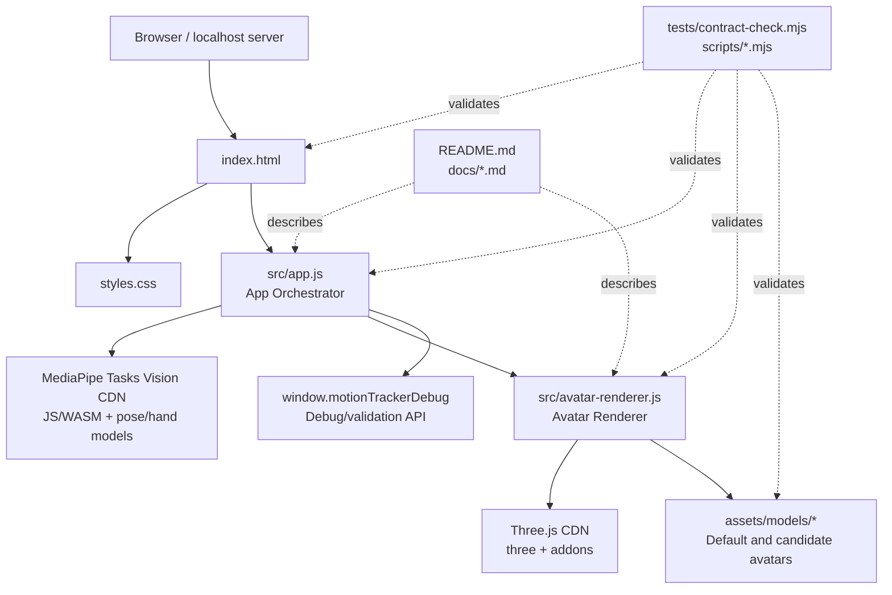

# Module Hierarchy

This document describes the current project hierarchy for `Browser Motion Tracker`.
It is a human-maintained architecture document for this static browser app.

## Overview

The project is a dependency-free static browser application. Runtime code is loaded
directly from `index.html` through ES modules and import maps. The central boundary is:

- `src/app.js` owns browser app orchestration, MediaPipe tracking, UI state, overlay drawing, and debug reports.
- `src/avatar-renderer.js` owns Three.js rendering, model loading, avatar retargeting, validation snapshots, view controls, and performance samples.
- Everything under `scripts/` and `tests/` is validation/tooling, not runtime application code.



## Runtime Module Tree

```text
Browser Motion Tracker
├─ Runtime shell
│  ├─ index.html
│  └─ styles.css
├─ App Orchestrator
│  └─ src/app.js
│     ├─ MediaPipe model lifecycle
│     ├─ camera/video input lifecycle
│     ├─ frame detection loop
│     ├─ 2D landmark overlay
│     ├─ metrics/status/error state
│     ├─ strict/depth validation aggregation
│     └─ debug API exposure
├─ Avatar Renderer
│  └─ src/avatar-renderer.js
│     ├─ Three.js scene lifecycle
│     ├─ GLB/VRM model loading
│     ├─ bone discovery and rest-pose cache
│     ├─ body/hand retargeting
│     ├─ validation snapshots
│     ├─ orbit view controls
│     └─ performance sampling
├─ Static assets
│  └─ assets/models/**
├─ Validation tooling
│  ├─ tests/contract-check.mjs
│  └─ scripts/*.mjs
└─ Documentation
   ├─ README.md
   └─ docs/*.md
```

## Module Contracts

### Runtime Shell

Owned scope:

- `index.html`
- `styles.css`

Public surface:

- DOM element IDs consumed by `src/app.js`.
- Import map entries for `three` and `three/addons/`.
- Module entrypoint script: `./src/app.js`.

Consumes:

- `app.orchestrator` through the `type="module"` script tag.
- `ui.styles` through the stylesheet link.

Internal scope:

- Layout and visual styling decisions in `styles.css`.
- Static HTML structure outside the documented DOM IDs.

Rules:

- Do not rename DOM IDs without updating `src/app.js` and `tests/contract-check.mjs`.
- Do not load runtime scripts with `file://`; the app expects a localhost browser context.

### App Orchestrator

Owned scope:

- `src/app.js`

Public surface:

- Browser UI behavior wired from the DOM IDs in `index.html`.
- `window.motionTrackerDebug.getBodyValidationReport()`
- `window.motionTrackerDebug.getBodyValidationSamples()`
- `window.motionTrackerDebug.getLastBodyValidationSample()`
- `window.motionTrackerDebug.getAvatarDepthScale()`
- `window.motionTrackerDebug.setAvatarDepthScale(value)`
- `window.motionTrackerDebug.getAvatarPerformanceReport()`
- `window.motionTrackerDebug.clearAvatarPerformanceSamples()`
- `window.motionTrackerDebug.getAvatarViewState()`
- `window.motionTrackerDebug.resetAvatarView()`
- `window.motionTrackerDebug.clearBodyValidation()`

Consumes:

- MediaPipe Tasks Vision through the CDN import in `src/app.js`.
- Public avatar renderer factory `createAvatarRenderer(options)`.
- Avatar renderer instance methods returned by `createAvatarRenderer`.
- Runtime shell DOM elements by documented ID.

Internal scope:

- Boot sequence and event binding.
- Camera and uploaded-video lifecycle.
- MediaPipe model selection and loading.
- Detection frame scheduling.
- Overlay drawing helpers.
- Strict/depth validation report builders.
- UI status and error text helpers.

Rules:

- `src/app.js` must not reach into `src/avatar-renderer.js` internals. It may only use the factory and returned API object.
- Debug API additions should be reflected in `README.md` and `tests/contract-check.mjs`.
- MediaPipe model URL/version changes must keep `tests/contract-check.mjs` aligned.

### Avatar Renderer

Owned scope:

- `src/avatar-renderer.js`

Public surface:

- `createAvatarRenderer(options)`

Returned API:

- `init()`
- `update({ poseResults, handResults, mirrored, timestamp })`
- `getBodyValidationSnapshot(options)`
- `getProjectedBodyPoseSnapshot(options)`
- `getDepthValidationSnapshot(options)`
- `setSkeletonVisible(value)`
- `setDepthScale(value)`
- `getDepthScale()`
- `getPerformanceSnapshot()`
- `clearPerformanceSamples()`
- `resetView()`
- `getViewState()`
- `resetPose()`
- `resize()`
- `dispose()`

Consumes:

- `three`
- `three/addons/environments/RoomEnvironment.js`
- `three/addons/loaders/GLTFLoader.js`
- Default or uploaded avatar model URLs.

Internal scope:

- Bone name normalization and aliasing.
- Model-kind detection.
- Pose and hand landmark normalization.
- Body, finger, head, neck, and limb retargeting.
- Rest-pose and proportion calibration.
- Swing/twist limiting.
- Validation row construction and summarization.
- Orbit camera pointer/wheel handling.
- Three.js resource disposal helpers.

Rules:

- Other runtime modules must not import helper functions from this file. The factory and returned API are the only public interface.
- New public methods must be added to the returned API object and documented here before `src/app.js` uses them.
- Avatar model loading failures must report failure state without breaking camera/video tracking.

### Static Avatar Assets

Owned scope:

- `assets/models/Xbot.glb`
- `assets/models/ratio-candidates/soldier.glb`
- `assets/models/anime-candidates/*.vrm`
- `assets/models/**/*.json`
- `assets/models/**/*.md`
- `assets/models/threejs-LICENSE.txt`

Public surface:

- Default model URL: `./assets/models/Xbot.glb`
- User-loadable GLB/GLTF/VRM files through the browser file picker.
- Candidate model metadata used by validation and documentation.

Consumes:

- No runtime JavaScript modules.

Internal scope:

- Candidate metadata details that are not referenced by README/docs/tests.

Rules:

- `Xbot.glb` is the default runtime fallback and should not be modified casually.
- Model candidates must stay within the budget gates documented in `docs/avatar-model-validation.md`.
- License attribution for bundled third-party assets must stay with the asset.

### Validation Tooling

Owned scope:

- `tests/contract-check.mjs`
- `scripts/avatar-performance-check.mjs`
- `scripts/avatar-glb-performance-check.mjs`
- `scripts/avatar-vrm-performance-check.mjs`

Public surface:

- `npm run check`
- `npm run perf:avatar`
- `npm run perf:avatar:soldier`
- `npm run perf:avatar:vrm`

Consumes:

- Runtime source files as static text.
- GLB/VRM model files as binary assets.
- `package.json` script declarations.

Internal scope:

- Parser/helper functions inside each validation script.

Rules:

- Validation scripts can inspect runtime internals as contract checks; runtime modules cannot depend on validation script internals.
- Keep validation scripts dependency-free unless the project intentionally adopts package dependencies.
- Add or update static checks whenever a public runtime contract changes.

### Documentation

Owned scope:

- `README.md`
- `docs/avatar-model-validation.md`
- `docs/MODULE_HIERARCHY.md`

Public surface:

- Local run instructions.
- Validation and performance gates.
- Runtime module boundaries and interface rules.

Consumes:

- Current source structure and validation scripts.

Internal scope:

- Historical notes that are not required to operate or maintain the app.

Rules:

- Documentation should describe verified behavior, not aspirational behavior.
- Any public debug API, model budget, or module boundary change should update the matching document in the same change set.

## Interface-Only Dependency Rules

Use these rules when implementing future module-scoped work:

1. Runtime modules may call another module only through the documented public surface.
2. A module's internal helpers are not a public interface, even if they are in the same file.
3. If a new feature needs another module's internal detail, first promote a minimal public method or return a change request for the owning module.
4. Validation tooling may inspect internals only to enforce contracts; it must not become a runtime dependency.
5. Public API changes must update this document, README/debug docs when relevant, and contract checks.

## Current Implementation-Orchestrator History

The repository contains historical local orchestration artifacts under
`.implementation-orchestrator-runs/`. They describe prior implementation work
such as strict validation, avatar tuning, and depth validation retargeting.
Those files are not runtime modules and are not the source of truth for the
current code hierarchy.

For new orchestrated work, create or update run state with the current
`implementation-orchestrator` skill and export a generated hierarchy document
from that state when the work units themselves need to be reviewed.
