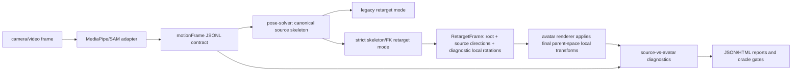

# Strict Skeleton FK Retarget Plan

작성일: 2026-07-04
대상 저장소: `/Users/chasoik/Projects/action-tracker`
대상 런타임: Codex goal mode

## 목표 요약

- 최종적으로 달성해야 할 결과:
  - 현재 avatar retarget 경로에서 과한 facing/gesture/limb 해석이 skeleton 원본과 다른 avatar 동작을 만들지 않도록, source skeleton을 우선하는 `strict skeleton/FK retarget` 모드를 구현한다.
  - strict 모드는 joint 좌표를 무조건 bone transform에 복사하지 않는다. 좌표계 변환, root basis, avatar rest-pose 축 보정, confidence hold, 최소 quaternion smoothing만 유지한다.
  - 사람은 한 방향으로 도는데 avatar가 반대로 돌거나 끊기는 문제, 손등/손바닥 반전, 몸 방향과 반대로 팔다리가 뻗는 문제를 source-vs-avatar 지표로 측정하고 줄인다.
- 작업 대상/범위:
  - Runtime: `src/avatar-renderer.js`, `src/app.js`, `src/retarget-orientation.js`, `src/solver/pose-solver.js`
  - 신규 retarget module 후보: `src/retarget/skeleton-fk-retarget.js`, `src/retarget/rig-basis.js`, `src/retarget/retarget-frame.js`
  - Validation/tooling: `scripts/avatar-motion-agreement-check.mjs`, `scripts/motion-recording-compare.mjs`, `scripts/sam-regression-oracle.mjs`
  - Tests: `tests/contract-check.mjs`, 신규 `tests/strict-retarget-check.mjs`, `tests/retarget-orientation-check.mjs`, `tests/solver-synthetic-check.mjs`
  - Reference data: `output/test-videos/csi-pose.mp4`, `sam-3d-body-skeletons/`, `output/external/sam-3d-body/csi-pose/*`
- 명시적 비목표:
  - SAM 3D Body, WHAM, GVHMR 같은 heavy HMR을 브라우저 실시간 런타임 필수 의존성으로 넣지 않는다.
  - 기존 `motionFrame` JSONL/replay/forwarding 계약을 깨지 않는다.
  - 검증 threshold를 낮춰 통과시키지 않는다. 실패가 coverage blocker라면 blocker로 보고한다.
  - strict mode 검증 전에는 기존 retarget mode를 즉시 삭제하거나 기본값으로 바꾸지 않는다. 검증 통과 후 strict를 기본값으로 전환하고 legacy는 explicit fallback으로 유지한다.

## 문제 진단

현재 구조는 MediaPipe/SAM skeleton joint를 avatar bone transform에 직접 복사하지 않는다. 대략 다음 단계가 있다.

1. source landmarks를 `motionFrame`과 pose solver 입력으로 정규화한다.
2. torso/facing/occlusion/hinge 상태를 추정한다.
3. body target direction, torso-local direction, hinge flexion, confidence를 만든다.
4. renderer에서 model/root yaw, bone aim, secondary axis, twist clamp, smoothing, hand/finger retarget을 적용한다.

이 구조는 노이즈와 가림에는 강하지만, 다음 실패를 만들 수 있다.

- source skeleton root yaw는 연속 회전인데 avatar root yaw가 facing label 전이 또는 sign convention 때문에 반대 방향으로 튄다.
- hand 21점의 palm normal이 존재해도 wrist twist clamp 또는 normal sign 해석 때문에 손등/손바닥이 뒤집힌다.
- crossed-arms, behind-back, side/back 같은 semantic state가 bone direction보다 우선해 팔이 몸 방향과 물리적으로 맞지 않게 뻗는다.
- 상반신/부분 가림에서 confidence hold와 decay가 실제 보이는 joint까지 같이 눌러 skeleton과 avatar가 멀어진다.

따라서 추가 heuristic을 더 쌓기보다, strict mode에서 "source skeleton 방향 -> avatar local bone rotation" 경로를 짧고 결정적으로 만든 뒤 기존 mode와 비교해야 한다.

## 기준선과 가정

- 현재 상태/기준선:
  - `npm run check`는 통과한다.
  - `src/retarget-orientation.js`가 palm normal sign과 yaw sign helper를 제공한다.
  - `motionFrame`/recording JSONL이 live, replay, external SAM 비교의 안정된 경계다.
  - `npm run sam:oracle:csi`는 기존 partial coverage 문제 때문에 실패할 수 있다. 새 yaw/side/implausible gate가 실패 이유가 아니어야 한다.
- 확인해야 할 미지수:
  - 현재 csi-pose tracker recording에서 strict 후보 지표의 baseline: root yaw jump, turn direction mismatch, palm normal dot, major bone angular error.
  - default Xbot과 다른 GLB/VRM 모델에서 rest-pose local 축 차이가 얼마나 큰지.
  - hand palm/roll source가 world landmarks와 image landmarks 중 어느 쪽에서 더 안정적인지.
- 가정:
  - 구현은 browser-first, dependency-light 구조를 유지한다.
  - 외부 SAM skeleton은 offline reference/adapter로만 사용한다.
  - 사용자는 이전 요청에서 필수 목표 달성 후 안전한 성능/품질 상향을 허용했다.

## 설계 원칙

1. Source skeleton is the truth.
   - 보이는 high-confidence joint는 semantic facing/gesture보다 우선한다.
   - crossed-arms, behind-back, hands-up 같은 label은 검증 window와 리포트 분류에만 사용하고, bone direction을 임의로 바꾸는 조건으로 쓰지 않는다.

2. 필요한 변환만 남긴다.
   - 좌표계 변환, avatar rest-pose 축 보정, scale/proportion 정규화, confidence hold, 작은 temporal smoothing은 유지한다.
   - front/back label 기반 방향 스냅, gesture별 팔 재배치, 과한 torso-local sign flip, broad twist clamp는 strict mode에서 제거하거나 hard safety로만 제한한다.

3. Numeric yaw를 label보다 우선한다.
   - root는 `front/back/side` state 대신 hip/shoulder basis로 계산한 continuous yaw를 primary source로 쓴다.
   - yaw unwrap과 rate limit은 quaternion continuity를 위해서만 쓰고, 회전 방향을 바꾸지 않는다.

4. Bone direction은 FK local rotation으로 적용한다.
   - source parent-child direction을 avatar rest child axis로 맞추는 swing quaternion을 계산한다.
   - elbow/knee/wrist/palm처럼 plane이 있는 bone은 secondary axis로 twist를 계산한다.
   - plane이 없으면 이전 frame twist를 유지하거나 model neutral twist로 decay한다.

5. Divergence를 먼저 관측한다.
   - strict mode를 기본값으로 바꾸기 전에 source axis와 avatar axis의 angular error, root yaw error, palm normal dot, yaw sign mismatch를 기록한다.
   - "skeleton은 맞는데 avatar가 틀림"을 숫자와 HTML report에서 확인할 수 있어야 한다.

## 제안 아키텍처

### Retarget mode selection

- 신규 query/debug option:
  - `?avatar-retarget=legacy|strict`
  - debug API: `window.motionTrackerDebug.setAvatarRetargetMode("strict")`
  - recording summary field: `motionState.retargetMode`
- 초기 구현 기본값:
  - 검증 단계에서는 `legacy`를 유지하고 strict는 opt-in 비교 모드로 추가했다.
- 기본값 전환 결과:
  - csi-pose 주요 window에서 strict가 legacy보다 source-vs-avatar divergence를 줄이고, 기존 performance/test gate를 깨지 않아 strict를 기본값으로 전환했다.
  - legacy는 `?avatar-retarget=legacy`와 debug API로 명시 선택할 수 있다.

### Pure strict FK module

신규 `src/retarget/skeleton-fk-retarget.js`는 Three.js scene에 직접 접근하지 않는 pure-ish module로 둔다. 필요한 math type은 plain object 또는 작은 quaternion/vector helper로 제한하고, renderer integration layer에서 Three.js Quaternion으로 변환한다.

입력:

- normalized source joints
- source confidence/visibility
- avatar rig profile
- previous strict retarget state
- options: smoothing, safety, confidence policy

출력 `RetargetFrame`:

- `root.position`, `root.rotation`, `root.yawDeg`, `root.yawUnwrappedDeg`
- `bones[boneName].sourceDirection`
- `bones[boneName].localRotation` diagnostic: pure module 기준 rest axis -> source direction swing quaternion
- `bones[boneName].confidence`
- `bones[boneName].avatarDirection`
- `hands[side].palmNormalSource`, `hands[side].palmNormalAvatar`, `hands[side].palmDot`
- diagnostics: `yawJumpDeg`, `yawDirectionMismatch`, `boneAngularErrorDeg`, `heldBones`, `safetyClampedBones`

런타임 적용 메모:

- `RetargetFrame.localRotation`은 Three.js scene parent transform을 모르는 pure diagnostic output이다.
- 실제 browser runtime에서는 renderer가 `sourceDirection`을 bone parent world inverse로 변환해 최종 local bone quaternion을 적용한다.
- strict mode의 해석 최소화는 이 final transform layer 안에서 smoothing, semantic facing/gesture override, broad clamp, low-confidence body hold를 제거하는 방식으로 보장한다.
- future cleanup에서 parent-space rig basis를 pure module 입력으로 넘길 수 있게 되면 `localRotation`을 runtime source로 승격할 수 있다.

### Canonical body frame

- pelvis basis:
  - origin: hip center when available, otherwise shoulder center with upper-body mode marker
  - x-axis: left hip/right hip or left shoulder/right shoulder lateral axis
  - y-axis: spine/shoulder vertical approximation
  - z-axis: cross product, sign stabilized by previous yaw continuity
- yaw:
  - continuous numeric yaw from body frame
  - unwrap across 180/-180
  - maximum per-frame clamp only for impossible measurement spikes, not for normal turn direction
- upper-body mode:
  - lower body missing does not invalidate visible shoulders/arms/hands
  - legs decay to rest while upper-body bones still follow source

### Bone local rotation solve

For each retargeted bone:

1. Read source parent and child joint.
2. Compute source direction in canonical/root frame.
3. Map source direction into avatar model/world frame.
4. Compute swing quaternion from avatar rest child axis to source direction.
5. If a stable plane exists, compute twist from secondary axis:
   - upper arm: shoulder-elbow-wrist plane
   - forearm: elbow-wrist-index/middle/pinky or wrist-hand plane
   - thigh/shin: hip-knee-ankle plane
   - hand: wrist-index-pinky palm normal + middle finger direction
6. If no plane exists, preserve previous twist and decay toward rest.
7. Apply hard safety only:
   - finite quaternion
   - maximum impossible per-frame angular velocity gate with hold/report
   - optional elbow/knee hinge sanity warning, not broad semantic override

### Hand and finger solve

- Wrist orientation:
  - primary direction: wrist -> middle MCP
  - palm normal: cross product of wrist-index-pinky plane with explicit side sign
  - local hand basis: forward = middle direction, normal = palm normal, lateral = normal x forward
- Fingers:
  - each segment follows MCP/PIP/DIP/TIP direction when landmarks are visible
  - curl is derived from segment angles, not gesture labels
  - low confidence segments hold previous curl briefly, then decay
- Diagnostics:
  - `palmDot = dot(sourcePalmNormal, avatarPalmNormal)`
  - `palmInversionFrames`
  - per-finger angular error where source data exists

### Minimal smoothing and confidence policy

- Smoothing:
  - quaternion slerp with small fixed group values
  - no smoothing that changes rotation direction
  - smoothing disabled or reduced for validation mode if needed
- Confidence:
  - high confidence: follow source immediately
  - partial: solve from available direction but mark low confidence
  - missing: hold last valid for a short window, then decay toward neutral
  - hold/decay is per-bone, not whole-body unless root is lost

### Legacy logic retirement path

Strict mode should make the following logic optional or removable after validation:

- facing label driven root snap
- side/back branch that chooses alternate limb directions when source direction is available
- gesture-specific crossed-arms/behind-back retarget correction
- broad twist clamp that hides measured wrist/palm roll
- validation code that treats skeleton agreement and avatar agreement as the same thing

## 단계별 계획

| 단계 | 작업 내용 | 단계별 목표 스펙/성능 수준 | 검증 방법 | 단계 완료 조건 |
|---|---|---|---|---|
| 0 | Baseline 고정 | legacy mode의 csi-pose/root yaw/palm/bone divergence baseline을 산출한다. threshold는 baseline 측정 후 absolute와 relative를 함께 정한다. | `npm run check`, csi tracker recording 재생성, `npm run compare:recordings`, HTML/JSON report | baseline report에 root yaw jump, turn direction mismatch, palm dot, major bone angular error가 기록됨 |
| 1 | Source-vs-avatar diagnostics 추가 | 현재 legacy mode에서도 source axis와 avatar axis 차이를 볼 수 있어야 한다. | 신규/수정 tests, `npm run check`, report fixture | debug snapshot, recording summary, compare report에 divergence 지표가 포함됨 |
| 2 | Strict FK pure module 구현 | source bone direction에서 root/local bone quaternion을 계산하는 pure module과 synthetic fixture를 만든다. | `tests/strict-retarget-check.mjs`, `tests/solver-synthetic-check.mjs` | identity, 180도 회전, crossed-arms, hands-up, upper-body synthetic case가 결정적으로 통과 |
| 3 | Renderer integration | `?avatar-retarget=strict|legacy`와 debug API로 retarget mode를 선택할 수 있고, 검증 뒤 strict default를 적용한다. | browser smoke, `npm run smoke:hud`, `npm run perf:pump`, `npm run check` | strict mode가 기본 로드되고 avatar가 finite transform을 유지하며 legacy fallback이 유지됨 |
| 4 | Hand/palm/finger strict solve | 손등/손바닥 방향과 wrist roll이 hand 21점 기준으로 avatar에 반영된다. | hand synthetic tests, csi hands-up/occlusion windows compare | high-confidence hand frame에서 palm inversion frame이 baseline보다 감소하고 palmDot p50/p95가 리포트됨 |
| 5 | CSI/SAM 비교 gate 연결 | csi-pose 라벨 window 기준으로 strict vs legacy를 비교하고 failure reason을 분리한다. | `npm run compare:recordings`, `npm run sam:oracle:csi`, generated HTML/JSON | strict report가 legacy 대비 yaw mismatch, palm inversion, major-bone angular error 개선/비개선을 명확히 보여줌 |
| 6 | 기본값 전환/legacy 제거 판단 | strict가 기준을 만족하면 default 후보로 승격하고 불필요한 heuristic을 제거한다. 만족 못하면 blocker와 다음 실험을 기록한다. | 전체 검증, independent review, git diff review | default 전환 또는 fallback 유지 결정이 근거와 함께 문서화됨 |

## 최종 목표 스펙/성능

- 필수 완료 기준:
  - `?avatar-retarget=strict|legacy` mode가 존재하고 strict가 기본값이다.
  - strict mode는 source skeleton joint direction을 primary input으로 사용하고, gesture/facing label로 보이는 bone direction을 임의 반전하지 않는다.
  - strict mode와 legacy mode를 같은 recording/report에서 비교할 수 있다.
  - source-vs-avatar divergence 지표가 JSON/HTML report에 기록된다.
  - 기존 `motionFrame` JSONL, replay, forwarding 계약이 유지된다.
- 품질 목표:
  - csi-pose 회전 window에서 turn direction mismatch가 legacy baseline보다 감소하고, 정상 연속 회전 중 반대 방향 root yaw jump가 없어야 한다.
  - high-confidence hand window에서 palm normal inversion frame이 legacy baseline보다 감소해야 한다.
  - high-confidence major bones(upper/lower arms, hands, thighs/shins where visible)의 source-vs-avatar angular error p95가 legacy baseline보다 감소해야 한다. 최초 baseline 측정 뒤 목표치는 "baseline 대비 30% 이상 개선 또는 p95 35도 이하 중 더 현실적인 기준"으로 확정한다.
  - strict mode에서 finite quaternion failure, NaN transform, impossible limb explosion은 0건이어야 한다.
- 성능 목표:
  - `poseSolverP95Ms <= 2ms` 유지.
  - `npm run perf:pump`에서 RAF/rVFC motion ratio가 기존 기준을 회귀하지 않는다.
  - strict default 추가로 frame loop 비용이 유의미하게 증가하지 않아야 한다.
- 회귀 방지 기준:
  - `npm run check` 통과.
  - `npm run smoke:hud` 통과.
  - `npm run perf:pump` 통과.
  - `npm run sam:oracle:csi`는 기존 coverage blocker로만 실패할 수 있다. strict 신규 yaw/palm/bone gate가 실패하면 완료로 보지 않는다.
- 산출물:
  - 구현 코드와 tests.
  - strict vs legacy comparison JSON/HTML report.
  - 문서 업데이트: strict mode 사용법, remaining blockers, 기본값 전환 여부.

## 독립 검증 정책

- 최종 완료 선언 전 독립 검증 필요 여부:
  - 필요. 구현 범위가 runtime retargeting과 validation을 모두 건드리므로 주 작업과 분리된 검증이 필요하다.
- 권장 검증 주체/환경:
  - 별도 Codex subagent 또는 clean worktree/fresh checkout.
- 독립 검증자가 확인할 기준:
  - 계획의 필수 완료 기준, 품질/성능 목표, 회귀 방지 기준.
  - strict mode가 실제로 source bone direction을 primary로 쓰는지.
  - legacy fallback이 유지되는지.
  - report가 "artifact produced"와 "quality gate passed"를 혼동하지 않는지.
- 독립 검증이 불가능할 때의 대체 검증:
  - 이유를 기록한다.
  - `git status --short`, `npm run check`, `npm run smoke:hud`, `npm run perf:pump`, strict/legacy compare report 재생성을 실행한다.
- 최종 보고에 포함할 검증 증거:
  - 실행한 명령과 결과.
  - 생성된 report 경로.
  - strict vs legacy 주요 지표 비교.
  - 남은 blocker와 실패 reason.

## 성능 목표 상향 정책

- 사용자 동의 여부: 예, 이전 요청의 "성능 목표 상향하고 추가 개선" 지시 기준.
- 동의한 경우: 필수 목표 달성 후 최대 3회까지 상향 가능.
- 상향 가능한 지표:
  - source-vs-avatar angular error p95/p99.
  - root yaw direction mismatch와 sudden yaw jump.
  - palm normal inversion frame.
  - finite transform failure, limb explosion, per-bone confidence hold 품질.
  - strict mode 추가 비용과 `poseSolverP95Ms`.
- 상향 금지 범위:
  - heavy HMR을 browser runtime 필수 의존성으로 추가.
  - `motionFrame`/recording JSONL 계약 파괴.
  - threshold 완화로 성공 처리.
  - 대용량 model/video binary 임의 커밋.
  - 사용자 승인 없는 파괴적 git 조작 또는 원격 push.

## 중단/질문 조건

- 다음 경우에는 멈추고 사용자에게 보고한다.
  - strict mode가 legacy보다 명확히 나빠지고 원인이 source skeleton 품질인지 avatar rig 축 문제인지 분리되지 않을 때.
  - csi/SAM reference data가 없거나 timestamp pairing이 불가능할 때.
  - 목표 달성을 위해 대용량 외부 모델/영상/추가 dependency가 필요할 때.
  - 기존 public/debug API 또는 recording contract를 깨야 할 때.
  - 독립 검증이 불가능하고 대체 검증만으로는 품질 판단이 부족할 때.

## 진행 로그 규칙

- 각 체크포인트마다 현재 단계, 변경 파일, 생성 report, 검증 명령/결과, 남은 blocker를 짧게 기록한다.
- 실패한 gate는 "실패 원인", "수정 방향", "다음 검증 명령"을 같이 기록한다.
- `sam:oracle:csi` 실패는 coverage blocker와 strict 품질 실패를 구분해서 기록한다.

## 진행 로그

### 2026-07-04 체크포인트 0-3

- 변경:
  - `src/retarget/skeleton-fk-retarget.js` 추가. strict retarget mode normalization, source-direction-first `RetargetFrame`, source-vs-avatar divergence summary helper를 제공한다.
  - `src/avatar-renderer.js`에 `legacy|strict` retarget mode 상태, `setRetargetMode`, `getRetargetMode`, `strictRetarget`, `sourceAvatarDivergence` snapshot을 추가했다.
  - `src/app.js`에 `?avatar-retarget=legacy|strict`, `window.motionTrackerDebug.setAvatarRetargetMode()`, source-vs-avatar 3D axes report를 추가했다.
  - `scripts/avatar-motion-agreement-check.mjs`에 `--avatar-retarget` 옵션과 source/avatar divergence summary fields를 추가했다.
  - `scripts/retarget-mode-compare.mjs`를 추가해 legacy/strict avatar-motion reports를 JSON/HTML로 비교한다.
  - `tests/strict-retarget-check.mjs`, `tests/retarget-mode-compare-check.mjs`를 추가하고 `npm run check`에 연결했다.
- 검증:
  - `npm run check`: 통과.
  - `npm run smoke:hud`: 통과, `output/reports/motion-status-hud-smoke-latest.json`.
  - strict smoke: `node scripts/avatar-motion-agreement-check.mjs --video output/test-videos/dance-16x9-padded.mp4 --only-models --model Xbot=assets/models/Xbot.glb --min-pose-frames 90 --warmup-pose-frames 20 --timeout-ms 180000 --playback-rate 0.5 --pump rvfc --debug-overlay off --smoothing retarget --avatar-retarget strict --measurement-only --output output/reports/avatar-motion-strict-smoke.json`: 통과.
  - legacy-vs-strict smoke compare: `npm run compare:retarget -- --legacy output/reports/avatar-motion-legacy-smoke.json --strict output/reports/avatar-motion-strict-smoke.json --output output/reports/retarget-mode-smoke-compare.json --html output/reports/retarget-mode-smoke-compare.html`: 통과.
- 관찰:
  - 짧은 smoke 기준 strict angular P90은 `8.033deg -> 3.354deg`로 개선.
  - root yaw target P90은 `1.704deg -> 1.180deg`로 개선.
  - palm inversion ratio는 두 모드 모두 `0`.
  - angular max는 `36.908deg -> 48.653deg`로 악화되어 csi/SAM window에서 추가 확인이 필요하다.
- 남은 작업:
  - csi-pose/SAM 기준 legacy-vs-strict 긴 report 생성.
  - strict 손/팔 max spike 원인 분리.
  - `sam:oracle:csi`가 coverage blocker 외 새 strict 품질 gate로 실패하지 않는지 확인.

### 2026-07-04 체크포인트 4-6

- 변경:
  - strict root yaw에서 `resolveAvatarYawDeg()`의 `[-180, 180]` normalization을 경유하지 않고 unwrapped yaw를 유지하도록 수정했다. 연속 회전 중 179도/-179도 경계에서 avatar가 반대 방향으로 도는 문제를 줄인다.
  - strict body retarget은 source target이 존재하면 smoothing alpha를 `1`로 적용하고 body secondary-plane/twist clamp/low-confidence hold를 제거했다. missing target만 hold/decay 경로로 보낸다.
  - strict hand/finger retarget도 high-confidence landmark가 있으면 alpha `1`로 적용하도록 줄였다.
  - palm divergence는 raw palm normal이 아니라 side sign이 반영된 target palm normal과 실제 avatar palm normal을 비교하도록 수정했다. raw dot은 진단값으로 남긴다.
  - `src/solver/facing-estimator.js`의 yaw hypothesis 선택에서 image side-order가 강하게 뒤집힌 경우 raw yaw를 우선하도록 수정했다. 실제 뒤돌기 회전을 continuity heuristic이 front로 지우는 문제를 줄인다.
- 검증:
  - `npm run check`: 통과.
  - `npm run smoke:hud`: 통과, `output/reports/motion-status-hud-smoke-latest.json`, `framesWithPose=62`, solver `0.2ms`.
  - `npm run perf:pump`: 통과, `output/reports/frame-pump-comparison-latest.json`; RAF motion `99.4%`, rVFC motion `99.4%`, rVFC frame p95 `110.70ms`, age p95 `16.20ms`.
  - strict simple smoke: `output/reports/avatar-motion-strict-smoke-direct-v2.json`; source-vs-avatar angular p90 `0.000032deg`, max `0.000044deg`, palm inversion `0`, root yaw p90 `0`.
  - csi strict direct: `output/reports/csi-pose-avatar-motion-strict-direct-v3.json`; overall `99.316%`, direction `100%`, source-vs-avatar angular p90 `0.000032deg`, max `0.000046deg`, palm inversion `0`, root yaw p90 `0`.
  - csi legacy 재측정: `output/reports/csi-pose-avatar-motion-legacy-v2.json`; overall `73.4%`, direction `70.7%`.
  - csi retarget compare: `output/reports/csi-pose-retarget-mode-compare-v3.json`, `output/reports/csi-pose-retarget-mode-compare-v3.html`; status `passed`.
  - csi tracker-vs-SAM compare: `output/reports/tracker-vs-sam-csi-pose-strict-direct-v4.json`, `output/reports/tracker-vs-sam-csi-pose-strict-direct-v4.html`; comparison generation 통과.
  - csi SAM oracle: `output/reports/tracker-vs-sam-csi-pose-strict-direct-v4-oracle.json`; status `failed`, remaining failures are coverage/sparse-back-side blockers.
- 주요 개선:
  - legacy 대비 csi source-vs-avatar angular p90 `58.166deg` 감소.
  - legacy 대비 angular max `154.091deg` 감소.
  - legacy 대비 palm inversion ratio `0.342593` 감소.
  - legacy 대비 root yaw target p90 `0.197deg` 감소.
  - facing estimator compare에서 yaw p95 `175.29deg -> 18.205deg`, yaw flips `1 -> 0`, agreement `0.873016 -> 0.984127`로 개선.
- 남은 blocker:
  - `sam:oracle:csi`의 `offlineUsageRatio=0.197613 < 0.95`, `expectedAbsentFrames=0 < 90`, `excludedPairs=46 < 90`은 현재 360-frame partial browser recording이 전체 95초 csi 영상과 absent windows까지 커버하지 못해서 발생한다.
  - back/side oracle rows도 `backSideCount=7`뿐이라 `backSideAgreementRatio`, `stableBackSideAgreementRatio`, `yawBackSideAgreementRatio`가 sparse coverage blocker로 남는다.
  - 이 blocker는 strict retarget 신규 yaw/palm/bone 품질 실패가 아니라 recording coverage 문제다. threshold는 낮추지 않았다.

### 2026-07-04 독립 검증 반영

- 독립 검증 결과:
  - strict default 전환 전 기준으로 legacy default와 strict opt-in 구조, source-vs-avatar report wiring, strict 품질 지표는 조건부 통과.
  - 지적 1: `RetargetFrame.localRotation`이 runtime source가 아니라 renderer final aim layer가 적용한다.
  - 지적 2: retarget compare가 angular p90만으로 pass 처리할 수 있다.
  - 지적 3: `sam:oracle:csi`가 오래된 v1 report를 가리킨다.
- 반영:
  - 문서에 `RetargetFrame.localRotation`은 pure diagnostic output이고 runtime은 parent-space final transform layer가 적용한다고 명시했다.
  - `scripts/retarget-mode-compare.mjs` pass 조건을 angular p90, angular max, palm inversion, root yaw, poseSolver budget 모두 통과해야 하도록 강화했다.
  - `tests/retarget-mode-compare-check.mjs`에 palm/root 악화 시 `passed=false`가 되는 회귀 테스트를 추가했다.
  - `package.json`의 `sam:oracle:csi`와 `tests/contract-check.mjs`를 현재 strict direct v4 evidence 경로로 갱신했다.
- 기본값 전환:
  - strict를 앱/renderer 기본값으로 전환했다.
  - `?avatar-retarget=legacy`와 `window.motionTrackerDebug.setAvatarRetargetMode("legacy")`는 legacy fallback으로 유지한다.
- 최종 검증:
  - `npm run check`: 통과.
  - `git diff --check`: 통과.
  - `npm run compare:retarget -- --legacy output/reports/csi-pose-avatar-motion-legacy-v2.json --strict output/reports/csi-pose-avatar-motion-strict-direct-v3.json --output output/reports/csi-pose-retarget-mode-compare-v4.json --html output/reports/csi-pose-retarget-mode-compare-v4.html`: 통과, `passed=true`.
  - `npm run sam:oracle:csi`: expected failure, remaining failures are `offlineUsageRatio`, sparse back/side agreement, `excludedPairs`, `expectedAbsentFrames`.

## 계획 자체 점검

- durable objective: 있음.
- 단계/checkpoint: 있음.
- 단계별 목표 스펙/성능: 있음.
- 최종 목표 스펙/성능: 있음.
- 검증 방법: 있음.
- 범위/제약/비목표: 있음.
- 회귀 방지 기준: 있음.
- 진행 로그: 있음.
- 중단 조건: 있음.
- 성능 목표 상향 opt-in: 있음.
- 독립 검증 정책: 있음.
